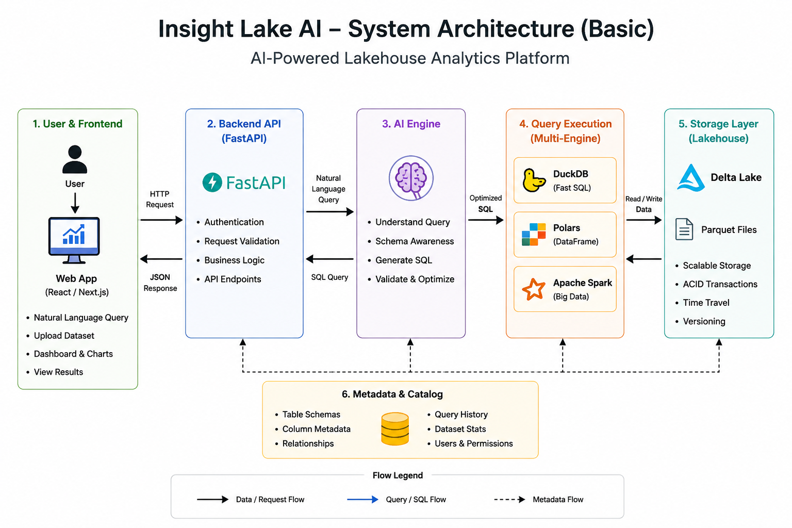

# 🌊 Insight Lake AI

### Intelligent Lakehouse-Based Data Analytics & Query System

> *Ask questions in plain English. Get instant analytics, charts, and dashboards — no SQL required.*

---

## 🌐 Project Overview

**Insight Lake AI** is a production-grade, intelligent analytics platform built on **Lakehouse Architecture**. It bridges the gap between raw data and business insights by eliminating the need for SQL expertise.

### 🎯 Problem Statement

Traditional analytics systems demand:

- ❌ Complex SQL query writing
- ❌ Deep understanding of database schemas
- ❌ Data engineering expertise
- ❌ Manual large-scale data processing

This blocks non-technical users — business analysts, managers, and decision-makers — from accessing data independently.

### ✅ The Solution

Insight Lake AI enables anyone to:

- ✅ Upload datasets (CSV / Parquet / Excel)
- ✅ Ask questions in plain English
- ✅ Receive AI-generated, optimized SQL automatically
- ✅ View results as interactive charts and dashboards
- ✅ Scale from small files to enterprise-scale big data

---

## 🌟 Core Features

🧠 AI Query Engine

- Natural Language → SQL conversion
- Schema-aware query generation
- Intent detection & understanding
- Query validation and auto-correction
- Smart query optimization
- AI-powered suggestions

⚡ Multi-Engine Query Execution

The system intelligently routes queries to the best execution engine:

| Engine | Best For | Advantage |
|--------|----------|-----------|
| **DuckDB** | Small / Medium datasets | Lightweight, ultra-fast in-memory SQL |
| **Polars** | Transformations, filtering, aggregations | Faster than pandas, memory-efficient |
| **Apache Spark** | Large-scale distributed workloads | Scalable, fault-tolerant, distributed |

📊 Interactive Dashboard Builder

- Drag & Drop widget placement
- Resizable layouts
- KPI Cards with live metrics
- Dynamic filters and drill-down analytics
- Dashboard persistence across sessions
- Real-time data updates

**Supported Visualizations:** Bar · Line · Pie · KPI Cards · Data Tables · Trend Reports

🗂️ Dataset Management

- Upload CSV, Parquet, Excel files
- Automatic schema and column type detection
- Dataset preview and sampling
- Null value and quality analysis
- Metadata extraction and cataloging
- Delta Lake versioned storage

🔐 Security & Access Control

- JWT-based Authentication
- Role-Based Access Control (RBAC)
- Three-tier roles: **Admin / Editor / Viewer**
- Project-level granular permissions
- Encrypted API access


---

# 🏗 System Architecture

<p align="center">
  
</p>

---

## 🔍 Architecture Deep Dive

### 1️⃣ Frontend Layer

> User-facing interaction layer built with modern React ecosystem.

**Technologies:** `React` · `Next.js` · `TypeScript` · `Tailwind CSS` · `ShadCN UI`

**Core Responsibilities:**

| Module | Description |
|--------|-------------|
| 🔍 NL Query Interface | Users type questions like `Show top 10 products by revenue` |
| 📊 Dashboard Builder | Drag-and-drop, resize, save, and filter dashboards |
| 📁 Dataset Upload | Accepts CSV, Parquet, and Excel files |
| 📈 Visualization | Charts, KPI cards, tables, trend reports |

**Flow:**
```
User Input → React Component → Axios/Fetch → FastAPI Backend
```

---

### 2️⃣ Backend API Layer (FastAPI)

> Central orchestration layer connecting all system components.

**Technologies:** `FastAPI` · `Python` · `SQLAlchemy` · `Pydantic`

**Core Responsibilities:**

| Module | Description |
|--------|-------------|
| 🛣️ Route Management | Handles `/analyze/query`, `/dataset/{id}/preview`, `/dashboard/page` |
| 🔐 Auth & Security | JWT token issuance, validation, RBAC enforcement |
| ✅ Request Validation | Pydantic schemas for queries, uploads, and configs |
| 🎯 Orchestration | Coordinates AI Engine, Query Planner, Storage, and Dashboards |

**Flow:**
```
Request → FastAPI Router → Auth Middleware → Service Layer → AI/Query/Storage → Response
```

---

### 3️⃣ AI Query Engine Layer

> The intelligence core — transforms plain English into precise SQL.

**Technologies:** `Google Gemini API` · `OpenAI API` · `LangChain`

**Example Transformation:**

```
User:  "Show monthly sales trend for 2025"
         ↓
AI Engine (Schema-Aware)
         ↓
```

```sql
SELECT
    month,
    SUM(sales) AS total_sales
FROM orders
WHERE year = 2025
GROUP BY month
ORDER BY month;
```

**AI Pipeline Components:**

```
Natural Language
       ↓
  Intent Detection       ← Identifies: metrics, filters, aggregations, grouping
       ↓
  Schema Awareness       ← Reads: tables, columns, relationships, data types
       ↓
  SQL Generation         ← Produces: optimized, schema-valid SQL
       ↓
  Validation & Fix       ← Auto-corrects: typos (slaes→sales), schema mismatches
       ↓
  Optimized SQL  ✅
```

---

### 4️⃣ Intelligent Query Execution Layer

> Dynamically routes queries to the optimal processing engine.

**Engine Selection Logic:**

```python
def select_engine(dataset_size, query_type):
    if dataset_size < 1_000_000_000:   # < 1 GB
        return use_duckdb()            # Ultra-fast in-memory SQL
    elif query_type == "transformation_heavy":
        return use_polars()            # Efficient DataFrame ops
    else:
        return use_spark()             # Distributed large-scale
```

**Engine Comparison:**

| Feature | DuckDB | Polars | Apache Spark |
|---------|--------|--------|--------------|
| Best For | SQL on small/medium data | Transformations | Big data |
| Speed | ⚡⚡⚡ | ⚡⚡⚡ | ⚡⚡ |
| Scale | MB–GB | MB–GB | GB–TB+ |
| Memory Model | In-memory | In-memory | Distributed |
| Fault Tolerant | ❌ | ❌ | ✅ |

**Flow:**
```
Optimized SQL → Query Planner → Engine Selection → Data Processing → Results
```

---

### 5️⃣ Storage Layer (Lakehouse Architecture)

> Modern unified storage combining Data Lake flexibility with Data Warehouse reliability.

**Technologies:** `Delta Lake` · `Apache Parquet`

**Lakehouse = Best of Both Worlds:**

| Capability | Data Lake | Data Warehouse | Lakehouse ✅ |
|------------|-----------|----------------|-------------|
| Storage Cost | Low | High | Low |
| Query Performance | Slow | Fast | Fast |
| Data Format | Flexible | Structured | Flexible |
| ACID Transactions | ❌ | ✅ | ✅ |
| Scale | Massive | Limited | Massive |
| Schema Evolution | Free | Rigid | Managed |

**Delta Lake Key Features:**
- 🔒 **ACID Transactions** — Safe concurrent reads/writes
- ⏳ **Time Travel** — Query any historical version of data
- 🔄 **Versioning** — Full data lineage and rollback support
- 📦 **Apache Parquet** — Columnar format for maximum analytics performance

**Flow:**
```
Query Engine → Read/Write Operations → Delta Lake → Parquet Files on Disk/Cloud
```

---

### 6️⃣ Metadata & Catalog Store

> The knowledge layer that makes AI smart about your data.

**Technologies:** `MySQL` · `PostgreSQL`

**Stores:**

| Metadata Type | Fields |
|---------------|--------|
| Table Schemas | `table_name`, `column_name`, `datatype`, `nullable` |
| Dataset Stats | `row_count`, `null_count`, `min`, `max`, `distinct_count` |
| Relationships | Foreign keys, join paths, entity relationships |
| Query History | User query, generated SQL, execution time, engine used |
| Permissions | User roles, project access, dataset permissions |

> 💡 **Why it matters:** Metadata is what makes the AI schema-aware. Without it, the AI cannot generate accurate, table-specific SQL.

---

### 7️⃣ Visualization & Dashboard Layer

> Transforms raw query results into actionable visual insights.

**Supported Chart Types:**

| Chart | Use Case | Library |
|-------|----------|---------|
| 📊 Bar Chart | Category comparisons | Recharts |
| 📈 Line Chart | Trends over time | Recharts |
| 🥧 Pie Chart | Proportion / distribution | Recharts |
| 🔢 KPI Cards | Key metric summaries | Custom |
| 📋 Data Table | Raw data exploration | ShadCN Table |

**Interactive Capabilities:** Dynamic Filters · Drill-Down · Live Updates · Export · Sharing

**Flow:**
```
Query Results → Visualization Engine → Render Charts → Dashboard → User Insights
```

---

## 📂 Backend Project Structure

```
backend/
│
├── 🧠 ai/                          ← AI Query Engine
│   ├── agents/                     ← LangChain agents (optional)
│   ├── prompts/                     ← Prompt templates for Gemini/OpenAI
│   ├── query_generator.py          ← NL → SQL conversion logic
│   ├── validator.py                ← SQL validation & error correction
│   └── optimizer.py                ← Query optimization strategies
│
├── 🛣️ api/
│   └── v1/                         ← Versioned API routes
│       ├── auth.py                 ← Login, register, token endpoints
│       ├── dashboard.py            ← Dashboard CRUD + layout APIs
│       ├── dataset.py              ← Upload, preview, schema APIs
│       └── analyze.py              ← AI query execution endpoint
│
├── ⚙️ core/
│   ├── config.py                   ← App settings (env vars, constants)
│   ├── security.py                 ← Password hashing, JWT utilities
│   └── auth.py                     ← Auth dependency injection
│
├── 🏔️ data_lake/
│   ├── delta/                      ← Delta Lake table storage
│   └── parquet/                    ← Raw Parquet file storage
│
├── 🗃️ db/
│   ├── models/                     ← SQLAlchemy ORM model classes
│   ├── session.py                  ← DB session factory
│   ├── base.py                     ← Declarative base class
│   └── init_db.py                  ← Schema initialization script
│
├── 🏛️ lakehouse/
│   ├── metadata/                   ← Schema & column metadata store
│   ├── tables/                     ← Lakehouse table registry
│   └── versions/                   ← Delta versioning index
│
├── 🗄️ models/
│   ├── user.py                     ← User ORM model
│   ├── project.py                  ← Project ORM model
│   ├── dashboard.py                ← Dashboard & widget models
│   └── dataset.py                  ← Dataset & schema models
│
├── ⚡ query_engine/
│   ├── duckdb_engine.py            ← DuckDB execution logic
│   ├── polars_engine.py            ← Polars DataFrame execution
│   ├── spark_engine.py             ← Apache Spark execution
│   └── planner.py                  ← Intelligent engine selector
│
├── ✅ schemas/
│   ├── auth.py                     ← Auth request/response schemas
│   ├── dashboard.py                ← Dashboard Pydantic schemas
│   ├── dataset.py                  ← Dataset upload/preview schemas
│   └── query.py                    ← Query request/response schemas
│
├── 🔥 spark/
│   ├── session.py                  ← SparkSession initialization
│   └── spark_utils.py              ← Delta Lake + Spark helpers
│
├── 📁 uploads/
│   └── project_1/                  ← Uploaded datasets per project
│
├── 📄 main.py                      ← FastAPI app entry point
├── 📄 requirements.txt             ← Python dependencies
├── 📄 insightlake.duckdb           ← DuckDB metadata database
├── 📄 .env                         ← Environment configuration
└── 📄 .gitignore                   ← Git ignore rules
```

---

## 🔄 End-to-End Workflow

```
 STEP 1  ──────────────────────────────────────────────────────
         📤 User uploads dataset (CSV / Parquet / Excel)

 STEP 2  ──────────────────────────────────────────────────────
         🔍 System auto-detects schema:
            columns · datatypes · null counts · relationships

 STEP 3  ──────────────────────────────────────────────────────
         💾 Metadata stored in MySQL/PostgreSQL catalog

 STEP 4  ──────────────────────────────────────────────────────
         💬 User types: "Show top 5 products by revenue"

 STEP 5  ──────────────────────────────────────────────────────
         🧠 AI Engine converts to SQL using schema context

 STEP 6  ──────────────────────────────────────────────────────
         ✅ System validates: tables · columns · syntax

 STEP 7  ──────────────────────────────────────────────────────
         🗺️  Query Planner selects: DuckDB / Polars / Spark

 STEP 8  ──────────────────────────────────────────────────────
         ⚡ Selected engine executes the query

 STEP 9  ──────────────────────────────────────────────────────
         🏔️  Data read from Delta Lake / Parquet files

 STEP 10 ──────────────────────────────────────────────────────
         📊 Results rendered as charts, KPIs, and dashboards
```

---

## ⚙️ Tech Stack

| Layer | Technology | Purpose |
|-------|------------|---------|
| **Frontend** | React, Next.js 14 | UI framework |
| **Styling** | Tailwind CSS, ShadCN UI | Design system |
| **Charts** | Recharts, Chart.js | Data visualization |
| **Backend** | FastAPI, Python 3.11+ | API & orchestration |
| **ORM** | SQLAlchemy | Database abstraction |
| **AI** | Google Gemini API | NL → SQL generation |
| **AI Alt** | OpenAI API, LangChain | Alternative AI providers |
| **Engine 1** | DuckDB | Fast SQL on small data |
| **Engine 2** | Polars | DataFrame transformations |
| **Engine 3** | Apache Spark | Distributed big data |
| **Storage** | Delta Lake | ACID lakehouse storage |
| **Format** | Apache Parquet | Columnar data format |
| **Metadata DB** | MySQL / PostgreSQL | Schema & catalog store |
| **Auth** | JWT + Passlib | Secure authentication |

---

## 🚀 Setup & Installation

### Prerequisites

| Tool | Version | Check Command |
|------|---------|---------------|
| Python | 3.11+ | `python --version` |
| Java | 17+ | `java -version` |
| Node.js | 18+ | `node -v` |
| npm | 8+ | `npm -v` |

---

### Step 1 — Clone the Repository

```bash
git clone https://github.com/your-username/InsightLakeAI.git
cd InsightLakeAI
```

---

### Step 2 — Java Installation (Required for Apache Spark)

Apache Spark requires **Java 17**. Download and install from:

- 🔗 **[Download Java 17 (Oracle)](https://www.oracle.com/java/technologies/javase/jdk17-archive-downloads.html)**
- 🔗 **[Download Java 17 (OpenJDK)](https://adoptium.net/temurin/releases/?version=17)**

Verify after install:

```bash
java -version
# Expected: openjdk version "17.x.x" or similar
```

---

### Step 3 — Hadoop Setup (Windows Only)

> ⚠️ **Linux / Mac users can skip this step.** Hadoop winutils is only required on Windows for Apache Spark to work correctly.

**Why is this needed?**
Apache Spark on Windows requires `winutils.exe` — a small Hadoop utility binary that Spark uses internally for file operations.

**Download `winutils.exe`:**

| Repository | Recommended For |
|------------|-----------------|
| 🔗 [cdarlint/winutils (GitHub)](https://github.com/cdarlint/winutils) | Hadoop 3.x (Spark 3.x) — **Recommended** |
| 🔗 [steveloughran/winutils (GitHub)](https://github.com/steveloughran/winutils) | Hadoop 2.x (Spark 2.x) |

**Setup Instructions:**

```
1. Create folder:       C:\hadoop\bin
2. Download:            winutils.exe  (match your Hadoop version)
3. Place file at:       C:\hadoop\bin\winutils.exe
```

**Configure Environment Variables:**

```
System Variable:
  HADOOP_HOME  =  C:\hadoop

Add to PATH:
  C:\hadoop\bin
```

> 💡 **Tip:** Set environment variables via `System Properties → Advanced → Environment Variables` on Windows.

**Restart your terminal**, then verify:

```bash
echo %HADOOP_HOME%
# Expected output: C:\hadoop
```

---

### Step 4 — Backend Setup

```bash
# Navigate to backend
cd backend

# Create virtual environment
python -m venv env

# Activate — Windows
env\Scripts\activate

# Activate — Linux / Mac
source env/bin/activate

# Install dependencies
pip install -r requirements.txt
```

---

## 🛡️ Environment Variables

### Backend — `backend/.env`

```env
# Database 
DATABASE_URL=duckdb:///./insightlake.duckdb

# Security
SECRET_KEY=your_super_secret_jwt_key_here
ALGORITHM=HS256
ACCESS_TOKEN_EXPIRE_MINUTES=30
FERNET_SECRET=your_fernet_encryption_key_here

# AI Configuration
GEMINI_API_KEY=your_google_gemini_api_key_here
```

> 🔑 **Generate a secure SECRET_KEY:** `python -c "import secrets; print(secrets.token_hex(32))"`

### Frontend — `frontend/.env.local`

```env
# ── API Connection ─────────────────────────────────────────────
VITE_API_URL=http://localhost:8000

# ── AI Key (if calling Gemini from frontend) ───────────────────
VITE_GEMINI_API_KEY=your_google_gemini_api_key_here
```

---

## ▶️ Running the Application

### Start Backend

```bash
cd backend
source env/bin/activate    # or env\Scripts\activate on Windows

uvicorn main:app --reload
```

| URL | Description |
|-----|-------------|
| `http://localhost:8000` | Backend API base URL |
| `http://localhost:8000/docs` | Swagger UI (interactive API docs) |
| `http://localhost:8000/redoc` | ReDoc API documentation |

### Start Frontend

```bash
cd frontend
npm run dev
```

| URL | Description |
|-----|-------------|
| `http://localhost:5173` | Frontend application |

---

## 📡 API Reference

### 🔐 Authentication

```http
POST   /auth/register        ← Create new user account
POST   /auth/login           ← Returns JWT access token
GET    /auth/me              ← Get current user profile
```

### 🗂️ Dataset

```http
POST   /dataset/upload               ← Upload CSV / Parquet file
GET    /dataset/{id}/preview         ← Preview dataset rows & schema
GET    /dataset/{id}/schema          ← Get detected schema metadata
DELETE /dataset/{id}                 ← Delete a dataset
```

### 🧠 AI Analysis

```http
POST   /analyze/query                ← Natural language → SQL → Results
```

**Request:**
```json
{
  "query": "Show total sales by region",
  "dataset_id": "ds_123",
  "project_id": "proj_456"
}
```

**Response:**
```json
{
  "chart_type": "bar",
  "x_axis": "region",
  "y_axis": "total_sales",
  "generated_sql": "SELECT region, SUM(sales) AS total_sales FROM orders GROUP BY region ORDER BY total_sales DESC",
  "engine_used": "duckdb",
  "execution_time_ms": 42,
  "rows": [
    { "region": "North", "total_sales": 120000 },
    { "region": "South", "total_sales": 95000 }
  ]
}
```

### 📊 Dashboard

```http
POST   /dashboard/page                   ← Create new dashboard page
GET    /dashboard/page/{id}              ← Get dashboard with widgets
PATCH  /dashboard/page/{id}/layout       ← Update widget layout positions
PATCH  /dashboard/widget/{id}            ← Update individual widget config
DELETE /dashboard/page/{id}              ← Delete dashboard page
```

---

## 🐞 Troubleshooting

| Issue | Cause | Fix |
|-------|-------|-----|
| `HADOOP_HOME is not set` | Env var missing or terminal not restarted | Add `HADOOP_HOME=C:\hadoop` and restart terminal |
| `Java Gateway Error` | Java 17 not installed or not in PATH | Run `java -version` and reinstall if missing |
| `ModuleNotFoundError` | Virtual environment not active | Run `env\Scripts\activate` (Win) or `source env/bin/activate` (Mac/Linux) |
| `Port 8000 already in use` | Another process on port 8000 | Run `uvicorn main:app --reload --port 8001` |
| `DuckDB file locked` | Another process has the DB open | Stop all running backend instances |
| `CORS Error in browser` | Frontend origin not allowed | Add frontend URL to CORS origins in `main.py` |
| `Gemini API quota exceeded` | API rate limit hit | Check Google AI Studio dashboard and upgrade plan |

---

## 🔮 Future Roadmap

- [ ] 🔄 **Streaming AI Responses** — Token-by-token SQL generation with progress indication
- [ ] 🤖 **Auto Chart Recommendations** — AI selects the best chart type per query
- [ ] 🔍 **Semantic Search** — Vector-based dataset and column discovery
- [ ] ⚡ **Query Caching** — Redis-backed result caching for repeated queries
- [ ] 🧬 **Vector Database Integration** — Pinecone / Weaviate for semantic metadata search
- [ ] 👥 **Real-Time Collaboration** — Multi-user shared dashboards with live cursors
- [ ] 🌊 **Spark Streaming** — Real-time data pipeline support
- [ ] 📨 **Kafka Integration** — Event-driven data ingestion
- [ ] 🤖 **AI Dashboard Generation** — Auto-generate complete dashboards from a single prompt
- [ ] ☁️ **Cloud Storage Support** — AWS S3, Azure Blob, GCS integration


---

## 📄 License & Author

**License:** [MIT](LICENSE) — free to use, modify, and distribute.

---
